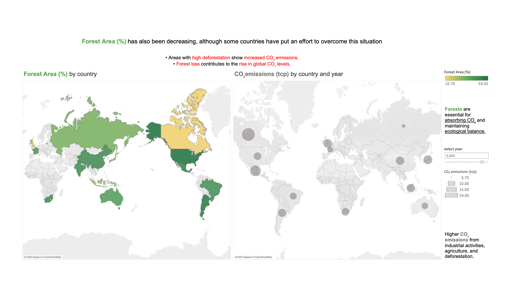

# Global Climate Change — Tableau Dashboard

**One-liner:** Interactive Tableau dashboard exploring global climate change indicators.

## Context
This project was developed as part of the **Data Science Bootcamp at CodeOp**.  
The goal was to build an interactive dashboard to explore global climate change trends through different indicators.

The dataset combines several indicators:
- 🌡️ Average temperature  
- 💨 CO₂ emissions  
- 🌳 Forest area  
- ⚡ Extreme weather events  

## Dashboards Available
The Tableau workbook includes multiple dashboards covering the indicators above.  

- 👀 **View online:** [Global Climate Change Dashboard on Tableau Public](https://public.tableau.com/shared/GW48DWTMX?:display_count=n&:origin=viz_share_link)  
- 📥 **Download workbook (.twbx):** [GlobalClimateDashboard.twbx](docs/Global-Climate-Change.twbx)  

Open the `.twbx` file in Tableau Desktop (free for students/educators) to explore all dashboards and the story in detail.

## Preview

## How to Use
1. Use the Tableau Public link for quick, interactive exploration online.  
2. Download the `.twbx` file for the full workbook, including all dashboards and the story.  
3. Navigate across dashboards using the bottom tabs.

## Data
See `data/README.md` for dataset sources and links.  
(Large data files are not versioned in this repository.)

## Repository Info
- **Description (short):** Tableau dashboard on climate change: temperature, CO₂ emissions, forest area, extreme weather events.  
- **Topics:** `tableau`, `climate-change`, `data-visualization`, `environment`, `co2`, `global-warming`
